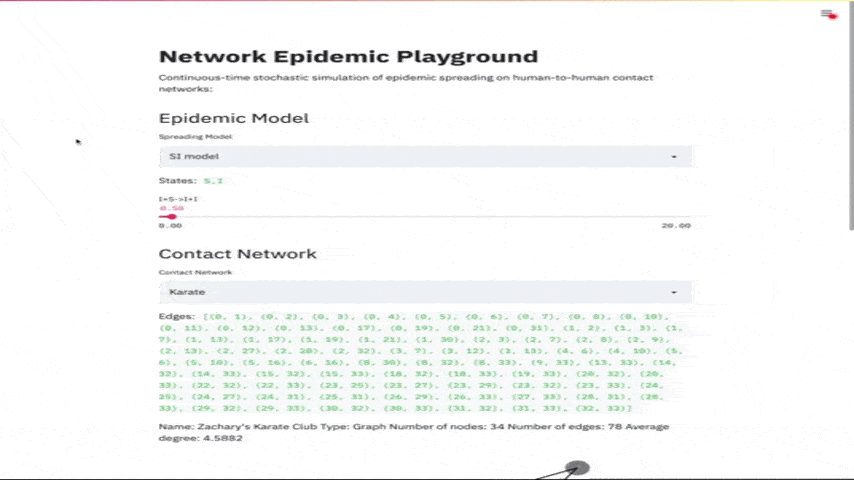

# NetworkEpidemicPlayground
Testing Streamlit for Epidemic-type Spreading Processes on Contact Networks

[](http://www.gnu.org/licenses/gpl-3.0)

Accessible online @ https://share.streamlit.io/gerritgr/networkepidemicplayground/main/app.py

### How to run
```console
pip install -r requirements.txt
streamlit run app.py
```


